# Introduction
#### Clean Architecture with DevSecOps is the showcase project to present best DevSevOps practices together with Clean Architecture patterns for building ASP .NET Core Web APIs hosted on Microsoft Azure cloud.

I would like to start with great sentence from Gerald Weinberg:

*"If builders built buildings the way programmers wrote programs, then the first woodpecker that came along would destroy civilization."*

This is so true and still actual. Nowadays it is not only about the software development but also about the whole strategy related with managing application lifecycle together with security.
The era of monolithic IT projects where changes were applied occasionally after release is history now. It does not matter if we are talking about projects in the cloud or on-premise. There is one goal: manage solution efficiently and shorten the time spent on management and changes implementation together with deployment.

**This is why developers should architect and design software solutions with maintainability in mind.**

This is why I decided to create this content - to present how software development is strognly related to DevOps and security (which is called DevSevOps). I collected information from many different great sources which I listed in each section of this article. I am using Azure DevOps as a tool to maintain best DevOps practices.
I hope you will find it helpful and interesting. Source code for the Web API application and Azure ARM templates is available [here in this repository](https://github.com/Daniel-Krzyczkowski/CleanArchitectureWithDevSecOps/tree/master/src).

*If you like this content, please give it a star!*


## Below main chapters are covered:

#### 1.	Clean architecture with Web API built with ASP .NET Core
#### 2.	DevSecOps - DevOps culture together with Security
#### 3.  Release faster with CI/CD automation 
#### 4.	Solution monitoring

&nbsp;

**Source code of the Web API application is located in the repository.**

Basically application business logic is related with learning. There are students and tutors and they can contact each other to schedule lessons.

&nbsp;

**To make it more understandable I created below solution architecture hosted on Microsoft Azure cloud:**


There are below Azure components used:

1. **Azure AD B2C** - to secure solution access
2. **Azure Key Vault** - to keep all the secrets used in the solution
3. **Azure Web App** - to host Web API application
4. **Azure API Management** - to control access to the Web API (quota limit for instance)
5. **Azure Notification Hub** - to send push notifications
6. **Azure SignalR Service** - to enable real-time chat
7. **Azure Cosmos DB** to store chat history and tutor learning profiles
8. **Azure SQL Database** - to store information about lessons


# Clean architecture with Web API built with ASP .NET Core

Even if you think right now that software architecture is not related with DevOps and DevSecOps, believe me you are wrong. I was too.
Let me start with Clean Architecture description.


As you can see in the above diagram, dependencies flow toward the innermost circle. The Application Core takes its name from its position at the core of this diagram. It has no dependencies on other application layers. The application’s entities and interfaces are at the very center. Just outside, but still in the Application Core, are domain services, which typically implement interfaces defined in the inner circle. Outside of the Application Core, both the UI and the Infrastructure layers depend on the Application Core, but not on one another (necessarily).
We can see that each part has its own responsibility:

In the center there are entities and interfaces and also services without any external infrastructure dependencies. This is the heart of the application - core business logic.
Then we have infrastructure part where all infrastructure services are located: like the one for sending push notifications in our case.
At the end there is UI layer where Controllers are located together with View Models.

Now if we would like to add unit tests it is much easier to do it because core logic does not have any infrastructure dependencies:


&nbsp;

In case of the project I prepared in this repository you can see that the structure is similar:

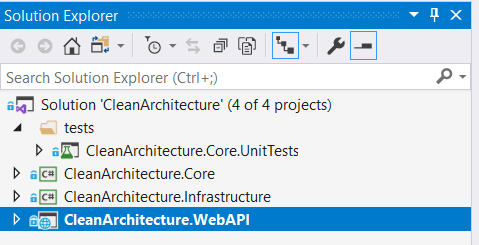

**CleanArchitecture.Core** project contains interfaces, entities, DTOs, Erros descriptions and services. There are no infrastructure dependencies included. This is the core logic of the application:

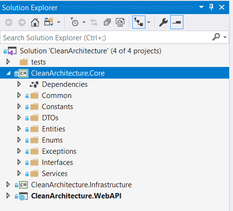

**CleanArchitecture.Infrastructure** project contains repositories implementations with Entity Framework Core and Cosmos DB SDK. This is the place where push notifications service is implement using Azure Notification Hub SDK:

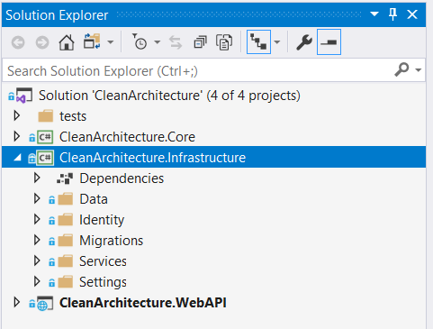

**CleanArchitecture.WebAPI** project contains controllers, SignalR Hub, dependencies registrations and request handlers (Mediator pattern is used):


**CleanArchitecture.Core.UnitTests** project contains unit tests for the services defined in the Core project:

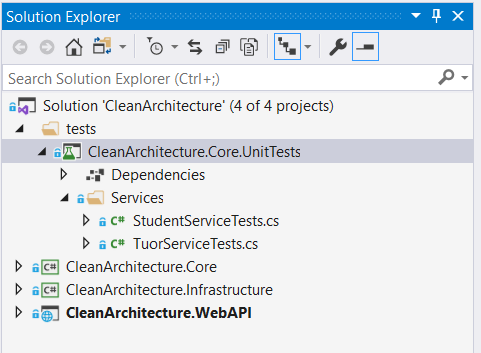


I encourage you to visit the repository and review the source code structure. Of course I am opened for any improvements in pull requests!

In this section I used content from below great sources:

1. [The Clean Architecture](https://blog.cleancoder.com/uncle-bob/2012/08/13/the-clean-architecture.html)
2. [Common web application architectures](https://docs.microsoft.com/en-us/dotnet/architecture/modern-web-apps-azure/common-web-application-architectures)

&nbsp;

#  DevSecOps - DevOps culture together with Security

Once we discussed Clean Architecture we can move to DevSecOps term. First lets describe what DevOps is.

**DevOps** is the combination of cultural philosophies, practices, and tools that increases an organization’s ability to deliver IT solutions and services fast and efficiently.
Thinking about DevOps in the context of a specific tool or team is wrong. DevOps also is often described as a set of practices to follow to achieve the planned end result in the shortest time possible.

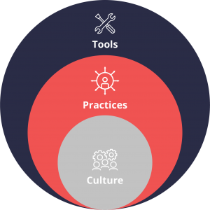

DevOps accelerates the company technical capabilities by affecting the following metrics:

* shorter time to market (improved deployment/release frequency)
* lower failure rate
* shorter lead time between fixes
* shorter mean time to recovery

If you would like to read more I encourage you to read [my article about DevOps.](https://predica.pl/blog/what-is-devops/) Now once we now what DevOps term is we can describe DevSecOps.

**DevSecOps (DevOps + Security)** is a practice that better aligns security, engineering, and operations and infuses security throughout the DevOps lifecycle.
It means that we extend DevOps best practices with securty aspect. What does it mean? Many things!

1. Create secure code from the start of development all the way to the deployed application
2. Secure and scan open-source libraries and third-party components
3. Apply security scanning on your source code
4. Do not keep credentials in the source code
5. Do not keep credentials in the infrastructure source code

There are many other points. I highly recommend to see [DevSecOps Security Checklist.](https://www.sqreen.com/checklists/devsecops-security-checklist)

&nbsp;

In case of the project I created for this article you can see that no credentials are stored in the source code of the application - like for instance in the "appsettings.json" file:

```csharp
{
  "ConnectionStrings": {
    "AppDatabase": "#{clean-arch-sql-db-connection-string}#"
  },
  "ApplicationInsights": {
    "InstrumentationKey": "#{put-instrumentation-key-here}#"
  },
  "AzureAdB2C": {
    "Tenant": "#{ad-b2c-tenant}#",
    "ClientId": "#{ad-b2c-client-id}#",
    "Policy": "#{ad-b2c-policy}#",
    "ExtensionsAppClientId": "#{extensions-app-client-id}#"
  },
  "AzureAdGraph": {
    "AzureAdB2CTenant": "#{ad-b2c-tenant}#",
    "ClientId": "#{ad-b2c-client-id}#",
    "ClientSecret": "#{ad-b2c-client-secret}#",
    "PolicyName": "#{ad-b2c-policy}#",
    "ApiUrl": "#{graph-api-url}#",
    "ApiVersion": "#{graph-api-version}#"
  },
  "MicrosoftGraph": {
    "AzureAdB2CTenant": "#{ad-b2c-tenant}#",
    "ClientId": "#{ad-b2c-client-id}#",
    "ClientSecret": "#{ad-b2c-client-secret}#",
    "ApiUrl": "#{graph-api-url}#",
    "ApiVersion": "#{graph-api-version}#"
  },
  "CosmosDb": {
    "Account": "#{cosmos-db-account}#",
    "Key": "#{cosmos-db-primary-key}#",
    "DatabaseName": "#{cosmos-db-name}#",
    "TutorLearningProfilesContainerName": "#{tutor-learning-profiles-cosmos-db-container}#",
    "ChatMessagesContainerName": "#{chat-messages-cosmos-db-container}#"
  },
  "Azure": {
    "SignalR": {
      "ConnectionString": "#{azure-signalr-connection-string}#"
    }
  },
  "NotificationHub": {
    "HubName": "#{azure-notification-hub=name}#",
    "HubDefaultFullSharedAccessSignature": "#{azure-notification-hub-access-signature}#"
  },
  "AllowedHosts": "*"
}

```

All above credentials are injected in the release pipelne in the Azure DevOps.

To enhance security of the application we can also use [NWebsec-Security libraries for ASP.NET Core](https://docs.nwebsec.com/en/latest/). These libraries work together to remove version headers, control cache headers, stop potentially dangerous redirects, and set important security headers. You can check how to use middleware in the "Startup.cs" file of the Web API application I developed.


We can check security of our ASP .NET Core Web app using [HSTS PreLoad website](https://hstspreload.org/). There we have to enter the domain and click the button. Report will be visible after few seconds.

**This is not the end!**

We can also use live code analysis rules and code fixes addressing API design, performance, security, and best practices for C# - there is great pugin for Visual Studio called [Microsoft Code Analysis 2019](https://marketplace.visualstudio.com/items?itemName=VisualStudioPlatformTeam.MicrosoftCodeAnalysis2019):


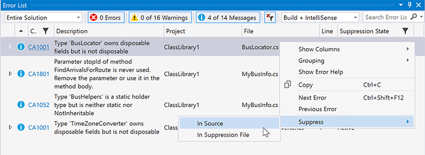

Of course there are a lot of different tools to apply security scanning - ath the end of this section I would like to mention two:

1. [WhiteSource Bolt](https://bolt.whitesourcesoftware.com/) - free developer tool for finding and fixing open source vulnerabilities
2. [OWASP ZAP Proxy](https://github.com/zaproxy/zaproxy) - one of the world’s most popular free security tools. It can help you automatically find security vulnerabilities in your web applications while you are developing and testing your applications.
3. [Sonar Cloud](https://sonarcloud.io/) - open source platform to inspect continuously the quality of source code and detect bugs, vulnerabilities and code smells in more than 20 different languages
4. [SonarQube](https://www.sonarqube.org/) - automatic code review tool to detect bugs, vulnerabilities and code smells in the source code

# Release automation with with Continuous Integration and Delivery

We discussed application architecture and DevSecOps aspects. In this section I would like to discuss different ways to manage infrastructure with best DevSecOps practices. Once again lets look at below solution architecture diagram:


We can see that there are many components. We can ask following questions:

1. Do we have to create them manually each time?
2. What can we do if there is a failure in one of them?
3. How to manage security?
4. Do we have to build app packages manually each time when there is a new feature available?

This is the case where Continous Integration and Continuous Delivery/Deployment terms are used. Lets discuss them first.

**Continuous Integration**

Development practice that requires developers to integrate code into a shared repository several times a day. Ensure that you do not ship broken code (automatic builds)
and applu security scan.

**Continuous Delovery**

Software engineering approach in which teams produce software in short cycles, ensuring that the software can be reliably released at any time.

**Continuous Deployment**

The difference between Continuous Delivery and Deployment is nicely shown on below image:

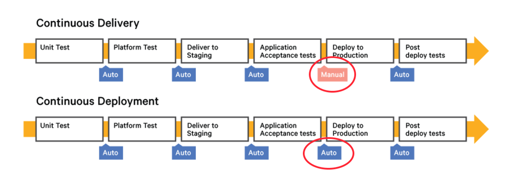

In the Continuous Delivery scenario there is automatic deployment on the production environment.

Lets look how it is configured in case of my project presented in this article.


**Continuous Integration - Build Pipelines**

I created separate GIT repositories:

1. For the infrastructure code
2. For the Web API application code
3. For the Azure AD B2C policies files

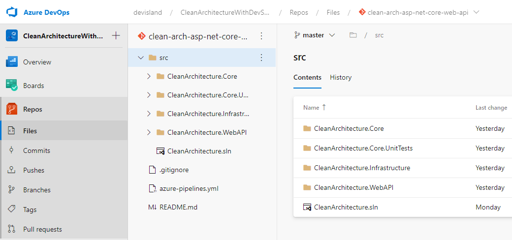

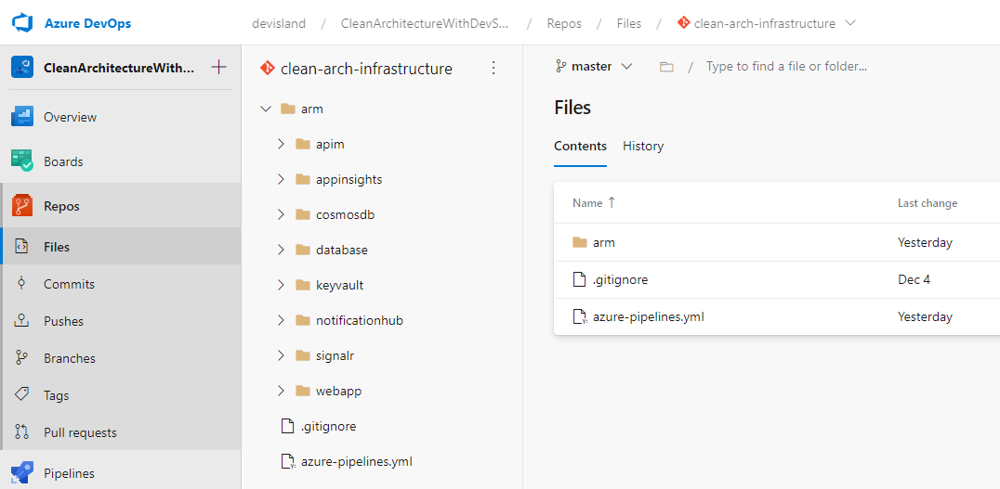

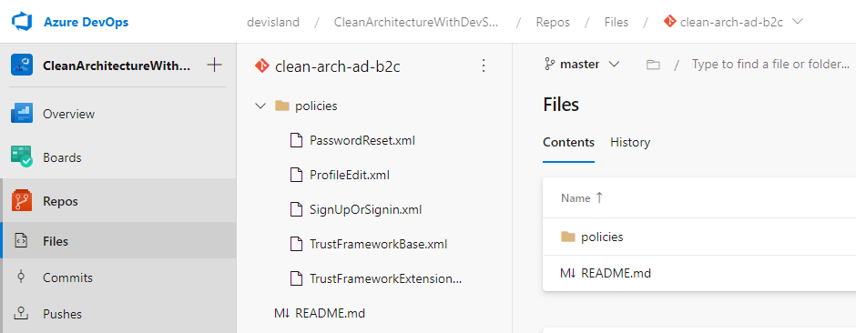

In the Azure DevOps I created two separate Build pipelines:

1. *CI-clean-arch-asp-net-core-web-api* - to build package with Web API application
2. *CI-clean-arch-dev-infrastructure* - to build the package with the infrastructure code for dev environment (I am using Infrastructure as a Code approach - IAC)

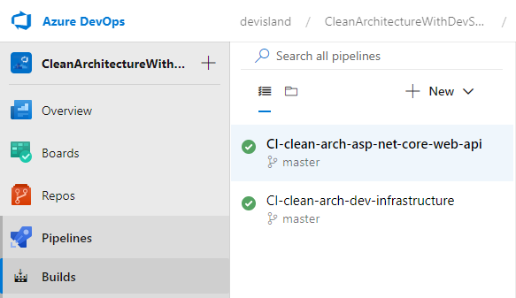

All secrets are stored in the Azure Key Vault and connected using Azure DevOps Variable Groups. If you would like to ready more I encourage you to check my blog articles about it:

1. [How to inject Azure Key Vault secrets in the Azure DevOps CI/CD pipelines](https://daniel-krzyczkowski.github.io/How-to-inject-Azure-Key-Vault-secrets-in-the-Azure-DevOps-CICD-pipelines/)
2. [Access Azure Key Vault secrets in the Azure DevOps Release Pipelines](https://daniel-krzyczkowski.github.io/Access-Azure-Key-Vault-secrets-in-the-Azure-DevOps-Release-Pipelines/)

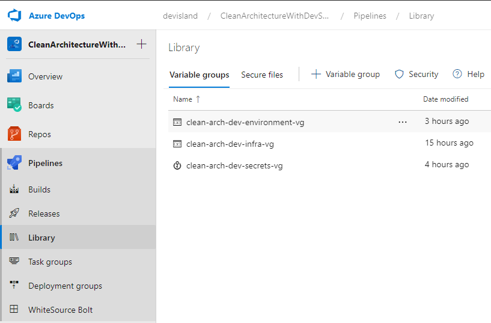

I have two additional groups to keep variables for environment configuration and application configuration.

This is the build pipeline for the Web API application:

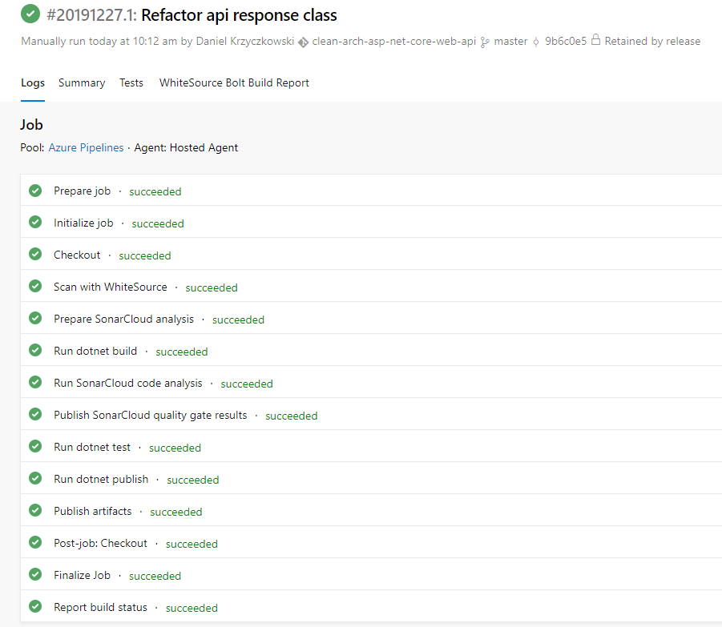

This is the YAML code of this build pipeline:

```yaml
# ASP.NET Core
# Build and test ASP.NET Core projects targeting .NET Core.
# Add steps that run tests, create a NuGet package, deploy, and more:
# https://docs.microsoft.com/azure/devops/pipelines/languages/dotnet-core

trigger:
- master

pool:
  vmImage: 'ubuntu-latest'

variables:
  buildConfiguration: 'Release'

steps:

- task: WhiteSource Bolt@19
  displayName: 'Scan with WhiteSource'
  inputs:
    cwd: '$(Agent.BuildDirectory)'

- task: SonarCloudPrepare@1
  displayName: 'Prepare SonarCloud analysis'
  inputs:
    SonarCloud: 'sonar-cloud-connection'
    organization: '$(sonar-cloud-organization-name)'
    scannerMode: 'MSBuild'
    projectKey: '$(sonar-cloud-project-key)'
    projectName: '$(sonar-cloud-project-name)'
    projectVersion: '$(Build.BuildNumber)'
    extraProperties: |
      sonar.cs.opencover.reportsPaths=$(Build.SourcesDirectory)/TestResults/Coverage/coverage.opencover.xml
      sonar.exclusions=**/wwwroot/lib/**/*

- task: DotNetCoreCLI@2
  displayName: 'Run dotnet build'
  inputs:
    command: 'build'
    projects: '**/*.csproj'

- task: SonarCloudAnalyze@1
  displayName: 'Run SonarCloud code analysis'

- task: SonarCloudPublish@1
  displayName: 'Publish SonarCloud quality gate results'

- task: DotNetCoreCLI@2
  displayName: 'Run dotnet test'
  inputs:
    command: test
    projects: '**/*Tests/*.csproj'
    arguments: '--configuration $(buildConfiguration)'

- task: DotNetCoreCLI@2
  displayName: 'Run dotnet publish'
  inputs:
    command: 'publish'
    publishWebProjects: true
    arguments: '--configuration $(BuildConfiguration) --output $(Build.ArtifactStagingDirectory)'
    zipAfterPublish: True

- task: PublishBuildArtifacts@1
  displayName: 'Publish artifacts'
  inputs:
    PathtoPublish: '$(Build.ArtifactStagingDirectory)'
    ArtifactName: 'drop'
    publishLocation: 'Container'

```

As you can see there is SonarCloud and White Source Bolt integrated so I can check the report related with code analysis. I also added step to execute unit tests:

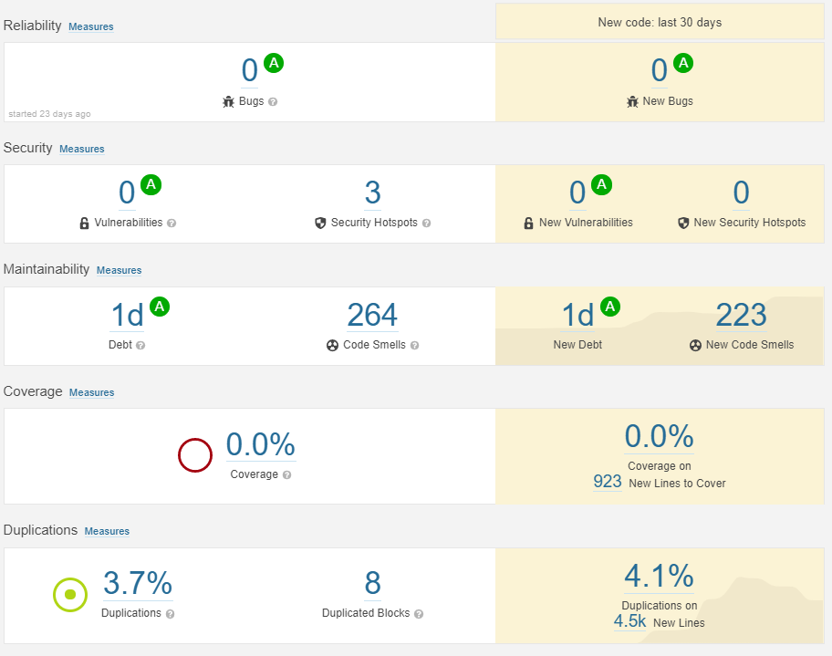

This is the build pipeline for the infrastructure code:

```yaml
# Starter pipeline
# Start with a minimal pipeline that you can customize to build and deploy your code.
# Add steps that build, run tests, deploy, and more:
# https://aka.ms/yaml

trigger:
- master

pool:
  vmImage: 'ubuntu-latest'

steps:
- task: replacetokens@3
  displayName: 'Replace arm template parameters with variables'
  inputs:
    targetFiles: '**/*.json'
    encoding: 'auto'
    writeBOM: true
    actionOnMissing: 'warn'
    keepToken: false
    tokenPrefix: '#{'
    tokenSuffix: '}#'

- task: CopyFiles@2
  inputs:
    SourceFolder: 'arm'
    Contents: '**'
    TargetFolder: '$(build.artifactstagingdirectory)'

- task: PublishBuildArtifacts@1
  inputs:
    PathtoPublish: '$(Build.ArtifactStagingDirectory)'
    ArtifactName: 'infra-dev'
    publishLocation: 'Container'
```

I am using [Replace Tokens extension for Azure DevOps](https://marketplace.visualstudio.com/items?itemName=qetza.replacetokens)
to inject parameters from the variable groups. With this approach I can have ARM templates stored int the source code repository and use them to create different environments.
Of course there are many great tools that support Infrastructure as a Code approach like [Terraform](https://www.terraform.io/).

There are two release pipelines created: one for the infrastructure and second one for the Web API application:

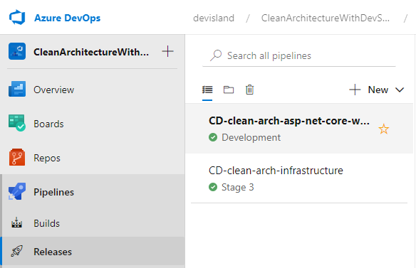

Deployment of the application can be done to one of four environments: dev, test, staging and production:


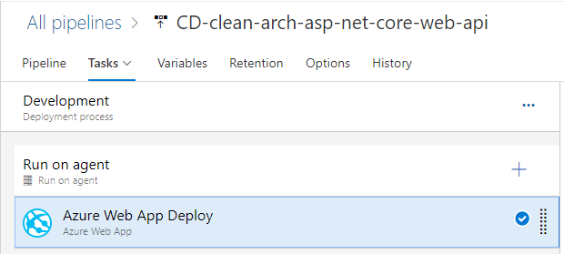

Configuration of Azure Web App is done during the deployment with below code. Parameters are securly injected:

```yaml
-ConnectionStrings:AppDatabase "$(clean-arch-sql-db-connection-string)" -ApplicationInsights:InstrumentationKey "$(clean-arch-app-insights-key)" -AzureAdB2C:Tenant $(clean-arch-azure-ad-b2c-tenant-dev) -AzureAdB2C:ClientId $(clean-arch-ad-b2c-tenant-client-id) -AzureAdB2C:Policy $(clean-arch-azure-ad-b2c-policy-name) -AzureAdGraph:AzureAdB2CTenant $(clean-arch-azure-ad-b2c-tenant-dev) -AzureAdGraph:ClientId $(clean-arch-users-identity-management-app-id) -AzureAdGraph:ClientSecret $(clean-arch-users-identity-management-app-secret) -AzureAdGraph:PolicyName $(clean-arch-azure-ad-b2c-policy-name) -AzureAdGraph:ApiUrl $(clean-arch-azure-ad-b2c-graph-api-url) -AzureAdGraph:ApiVersion $(clean-arch-azure-ad-b2c-graph-api-version) -AzureAdGraph:ExtensionsAppClientId $(clean-arch-identity-experience-framework-directory-extensions-app-id) -MicrosoftGraph:AzureAdB2CTenant $(clean-arch-azure-ad-b2c-tenant-dev) -MicrosoftGraph:ClientId $(clean-arch-users-identity-management-app-id) -MicrosoftGraph:ClientSecret $(clean-arch-users-identity-management-app-secret) -MicrosoftGraph:ApiUrl $(clean-arch-microsoft-graph-api-url) -MicrosoftGraph:ApiVersion $(clean-arch-microsoft-graph-api-version) -CosmosDb:Account $(clean-arch-cosmos-db-account) -CosmosDb:Key $(clean-arch-cosmos-db-key) -CosmosDb:DatabaseName $(clean-arch-cosmos-db-name) -CosmosDb:TutorLearningProfilesContainerName $(clean-arch-cosmos-db-tutor-learning-profiles-container-name) -CosmosDb:ChatMessagesContainerName $(clean-arch-cosmos-db-chat-messages-container-name) -Azure:SignalR:ConnectionString $(clean-arch-signalr-connection-string) -NotificationHub:HubName $(clean-arch-notification-hub-name) -NotificationHub:HubDefaultFullSharedAccessSignature $(clean-arch-notification-hub-connection-string)
```

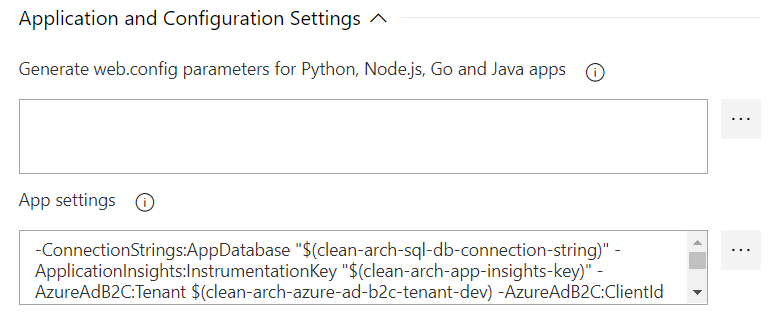

If we look at the release pipeline for the infrastructure we can define which environment will be created: dev, test, staging or prod. Below example presents flow for the dev environment:

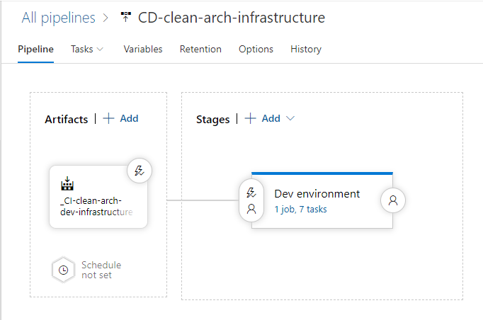


In this case infrastructure code is stored in the GIT repository - ARM templates together with parameters json files:


Once deployment is completed I can see all the components in the Azure portal:


If you would like to stick to the naming conventions for Azure I really encourage you to check [Ready: Recommended naming and tagging conventions](https://docs.microsoft.com/en-us/azure/cloud-adoption-framework/ready/azure-best-practices/naming-and-tagging).


# Solution monitoring

Solution monitoring is very important part of the DevOps loop.

In the Azure DevOps I have also setup dashboard to monitor build and release pipelines status:
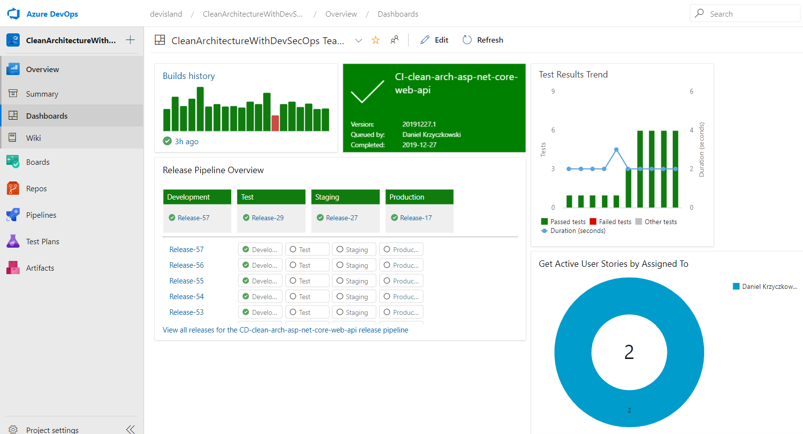

In this case I used [Azure Application Insights](https://docs.microsoft.com/en-us/azure/azure-monitor/app/app-insights-overview) service which is integrated with my solution:

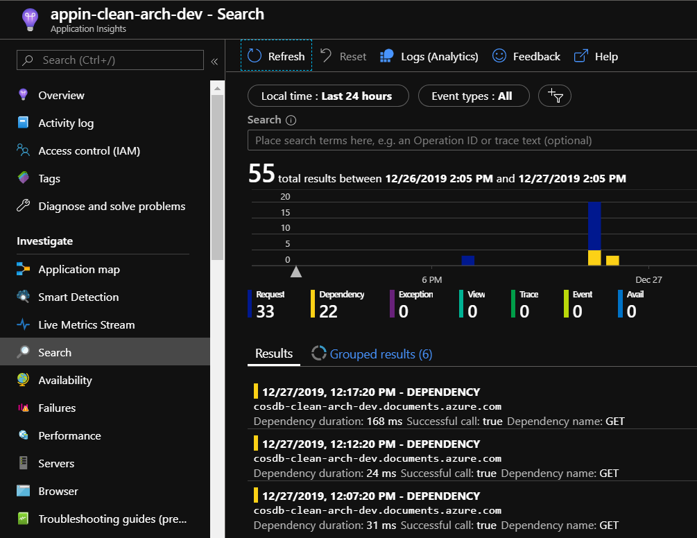

# Summary

In this article I wanted to present different aspects of Clean Architecture together with DevSevOps. I hope you found it interesting and valuable. In case of any questions please contact me on Twitter or LinkedIn. Of course any comments more than welcome because this is not one, the best approach in the world. This is to inspire people how different Dev and Ops and Security parts are connected together.
